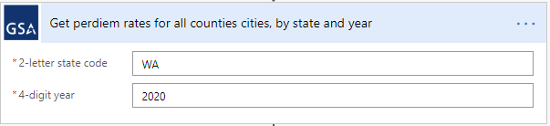
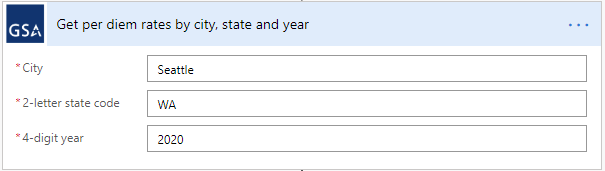
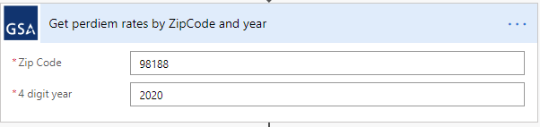
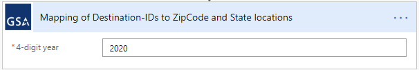

---

---

<h1 id="gsa-per-diem-connector">GSA-Per-Diem-Connector</h1>

Power Platform Custom Connector for the GSA Per Diem (<a href="https://open.gsa.gov/api/perdiem/">https://open.gsa.gov/api/perdiem/</a>). This is a Power Platform custom connector for interacting with the US Government’s General Servies Administration (GSA) Per Diem tables. This is a database of US Government allowed travel expenses and amounts, by location. 
All amounts are in US Dollars.  All years are 4-digit years and correspond to the US government’s fiscal year.  All status use standard 2-letter state codes.

<h1 id="api-key">API Key</h1>

All calls to the GSA SAM API require an API key.  The process for betting that API is described on the GSA API site here: <a href="https://open.gsa.gov/api/perdiem/">https://open.gsa.gov/api/perdiem/</a> 
This will provide an API key that you will need to create a connection with this custom connector.  These API keys are shared across GSA APIs.  If you have created an API key for a different GSA API, it should work for this use too.

<h1 id="basics">Basics</h1>

Lodging per diem amounts are returned along side a month array in a structure that looks like this: 
For each city the API returns an <strong>array</strong> of months identified as:

<table>
<thead>
<tr>
<th>Description</th>
<th>Returned</th>
<th>Example</th>
</tr>
</thead>
<tbody>
<tr>
<td>Month Number</td>
<td>number</td>
<td>8</td>
</tr>
<tr>
<td>Short Name</td>
<td>short</td>
<td>Aug</td>
</tr>
<tr>
<td>Long Name</td>
<td>long</td>
<td>August</td>
</tr>
<tr>
<td>Lodging Per Diem</td>
<td>value</td>
<td>100</td>
</tr>
</tbody>
</table>
For each city, the meal per diem is returned in a structure like this:

<table>
<thead>
<tr>
<th>Description</th>
<th>Returned</th>
<th>Example</th>
</tr>
</thead>
<tbody>
<tr>
<td>Meal Per Diem</td>
<td>meals</td>
<td>76</td>
</tr>
<tr>
<td>Zip Code</td>
<td>zip</td>
<td>98188 (can be null)</td>
</tr>
<tr>
<td>County</td>
<td>county</td>
<td>King</td>
</tr>
<tr>
<td>City</td>
<td>city</td>
<td>Seattle</td>
</tr>
<tr>
<td>Standard Rate</td>
<td>standardRate</td>
<td>false</td>
</tr>
</tbody>
</table><h1 id="methods">Methods</h1>

This connector supports five methods:

<h2 id="rates-by-stateyear">Rates by state/year</h2>

 
Returns a list across an entire US state (using the 2-letter code) for a specified 4-digit year.  The API will return past (back to 2010) and future (as available) per diem amounts.

For each available region (county/city) the results will contain an array of lodging per diem amounts and meal per diem amounts (as described in Basics).

<h2 id="rates-by-citystateyear">Rates by city/state/year</h2>

 
Provide an input of a city, state and zip:

<table>
<thead>
<tr>
<th>Name</th>
<th>Description</th>
<th>Example</th>
</tr>
</thead>
<tbody>
<tr>
<td>city</td>
<td>Destination city</td>
<td>Fairfax</td>
</tr>
<tr>
<td>state</td>
<td>Destination state</td>
<td>VA</td>
</tr>
<tr>
<td>year</td>
<td>Fiscal year of travel. Available back to 2010.</td>
<td>2019</td>
</tr>
</tbody>
</table>
For the specified city the results will contain an array of lodging per diem amounts and meal per diem amounts (as described in Basics).

<h2 id="rates-by-zipyear">Rates by zip/year</h2>

 
Provide inputs:

<table>
<thead>
<tr>
<th>Name</th>
<th>Description</th>
<th>Example</th>
</tr>
</thead>
<tbody>
<tr>
<td>zip</td>
<td>Destination zip code</td>
<td>20171</td>
</tr>
<tr>
<td>year</td>
<td>Fiscal year of travel. Available back to 2010.</td>
<td>2019</td>
</tr>
</tbody>
</table>
For the specified zip code the results will contain an array of lodging per diem amounts and meal per diem amounts (as described in Basics).

<h2 id="lodging-rates-for-the-continental-u.s.-by-year">Lodging Rates for the Continental U.S. by Year</h2>

 
Provide inputs:

<table>
<thead>
<tr>
<th>Name</th>
<th>Description</th>
<th>Example</th>
</tr>
</thead>
<tbody>
<tr>
<td>year</td>
<td>Fiscal year of travel. Available back to 2010.</td>
<td>2019</td>
</tr>
</tbody>
</table>
For the specified year, the connector returns an array of arrays, each consisting of the monthly lodging per diem and a single meals per diem, along with the related city name, state, county and Destination ID (DID) a unique ID for the city and state pair.

<table>
<thead>
<tr>
<th>Returned</th>
<th>Example</th>
</tr>
</thead>
<tbody>
<tr>
<td>Jan</td>
<td>108</td>
</tr>
<tr>
<td>Feb</td>
<td>108</td>
</tr>
<tr>
<td>Mar</td>
<td>108</td>
</tr>
<tr>
<td>Apr</td>
<td>108</td>
</tr>
<tr>
<td>May</td>
<td>108</td>
</tr>
<tr>
<td>Jun</td>
<td>108</td>
</tr>
<tr>
<td>Jul</td>
<td>108</td>
</tr>
<tr>
<td>Aug</td>
<td>108</td>
</tr>
<tr>
<td>Sep</td>
<td>108</td>
</tr>
<tr>
<td>Oct</td>
<td>108</td>
</tr>
<tr>
<td>Nov</td>
<td>108</td>
</tr>
<tr>
<td>Dec</td>
<td>108</td>
</tr>
<tr>
<td>Meals</td>
<td>61</td>
</tr>
<tr>
<td>City</td>
<td>Spokane</td>
</tr>
<tr>
<td>State</td>
<td>WA</td>
</tr>
<tr>
<td>County</td>
<td>Spokane</td>
</tr>
<tr>
<td>DID</td>
<td>390</td>
</tr>
</tbody>
</table><h2 id="mapping-of-destination-ids-to-zipcode-and-state-locations">Mapping of Destination-IDs to ZipCode and State locations</h2>

 
Provide input:

<table>
<thead>
<tr>
<th>Name</th>
<th>Description</th>
<th>Example</th>
</tr>
</thead>
<tbody>
<tr>
<td>year</td>
<td>Fiscal year of travel. Available back to 2010.</td>
<td>2019</td>
</tr>
</tbody>
</table>
Returns an array of arrays that is the complete catalog of Destination IDs (DID).

<table>
<thead>
<tr>
<th>Returned</th>
<th>Description</th>
<th>Example</th>
</tr>
</thead>
<tbody>
<tr>
<td>DID</td>
<td>A destination-ID</td>
<td>305</td>
</tr>
<tr>
<td>Zip</td>
<td>The ZipCode this destination-ID resides within</td>
<td>97257</td>
</tr>
<tr>
<td>ST</td>
<td>The state this destination-ID resides within</td>
<td>OR</td>
</tr>
</tbody>
</table>
